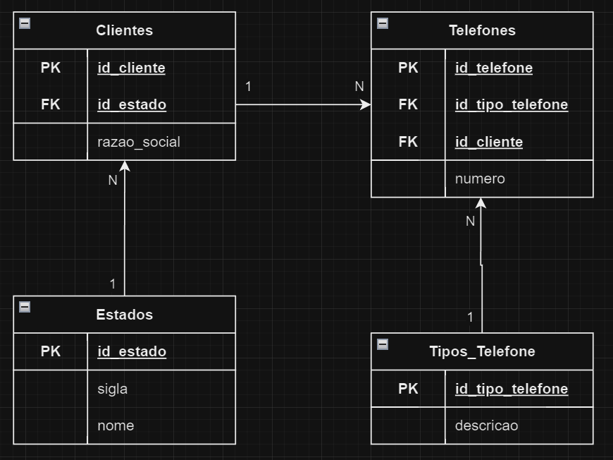

## Diagrama das Tabelas



No diagrama acima:
- **Clientes**: Tabela contendo o `id_cliente` como chave primária (PK), `id_estado` como chave estrangeira (FK) e a `razao_social`.
- **Telefones**: Tabela contendo o `id_telefone` como chave primária (PK), `id_tipo_telefone` e `id_cliente` como chaves estrangeiras (FK) e o `numero` do telefone.
- **Tipos_Telefone**: Tabela contendo o `id_tipo_telefone` como chave primária (PK) e sua `descricao` (comercial, residencial, celular, etc).
- **Estados**: Tabela contendo `id_estado` como chave primária (PK), `sigla` e `nome` do estado.

## Busca SQL

Busca utilizando comando SQL que traz o código, a razão social e o(s) telefone(s) de todos os clientes do estado de São Paulo (código “SP”):

```sql
SELECT 
    c.id_cliente, 
    c.razao_social, 
    t.numero AS telefone
FROM 
    Clientes c
JOIN 
    Telefones t ON c.id_cliente = t.id_cliente
JOIN 
    Estados e ON c.id_estado = e.id_estado
WHERE 
    e.sigla = 'SP';
```